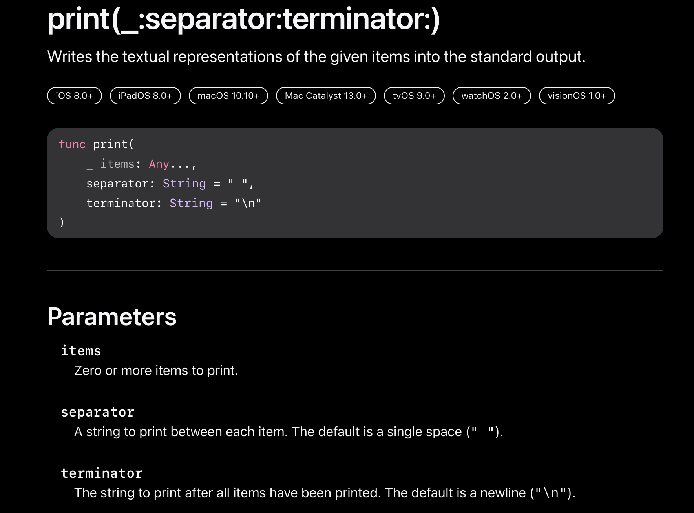

# print(_:separator:terminator:)

익숙하게 쓰고있지만 한번도 공식 문서는 찾아본 적 없는 함수들에 대해서

이번에 코테를 조금씩 공부하며 찾아보게 되었다

- [ Parameters ]
    
    items → 0개 이상의 아이템을 출력
    
    separator → item 사이에 해당 string 을 출력 ( 디폴트 공백 )
    
    terminator → 모든 item 을 출력한 뒤에 해당 string을 출력 ( 디폴트 \n )
    
    우리가 평소에 print( ) 이렇게 괄호 안에 print할 내용을 적었던 것은
    
    items 에 해당하는 내용 이었던 것이고,
    
    그거 말고도 print할 내용들 사이나 끝에도 뭔가를 찍을 수 있었다!
    
    좀 더 파악해보기 위해 이것저것 활용해봤다
    

seperator는 출력하는 **item 들 사이에 출력**하는 것,

terminator은 **item들을 다 출력하고나서 출력**하는 건데..

swift에서 개행 문자를 넣지않아도 print할 때 줄바꿈이 됐던건

**terminator 옵션의 디폴트 값이 \n이기 때문**이었다!

그럼 이만 ..
